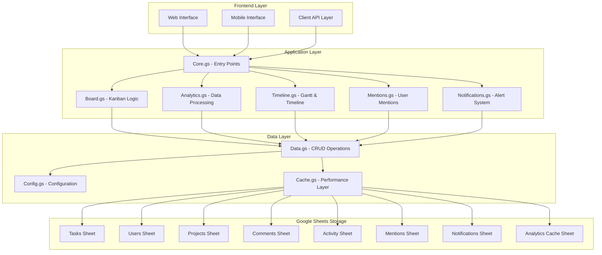

# Design Document

## Overview

This design document outlines the architecture and implementation approach for transforming the existing ProjectFlow Google Apps Script project management system into an enterprise-grade solution. The design maintains the current lightweight architecture while adding sophisticated features including user mentions, timeline visualization, advanced analytics, and comprehensive project management capabilities.

The solution leverages Google Apps Script's strengths while incorporating modern web technologies for enhanced user experience. Key design principles include maintaining data integrity, ensuring scalability within GAS constraints, and providing intuitive user interfaces for complex enterprise features.

## Architecture

### System Architecture

The enterprise ProjectFlow system extends the existing modular architecture with new components:



### Technology Stack

**Backend (Google Apps Script)**
- Core: Google Apps Script (JavaScript ES6+)
- Data Storage: Google Sheets with optimized schema
- Caching: In-memory caching with sheet-based persistence
- Analytics: Custom algorithms with statistical calculations
- Notifications: Gmail API integration

**Frontend (Web Interface)**
- Framework: Vanilla JavaScript with modern ES6+ features
- UI Library: Tailwind CSS for responsive design
- Charts: Google Charts API for analytics visualization
- Gantt Charts: Frappe Gantt (lightweight, no external dependencies)
- Mentions: Custom autocomplete implementation

**Mobile Support**
- Progressive Web App (PWA) capabilities
- Responsive design with touch-optimized interactions
- Offline data caching using localStorage
- Service worker for background sync

## Components and Interfaces

### Core Components

#### 1. Enhanced Comment System with Mentions

**MentionEngine Class**
```javascript
class MentionEngine {
  // Parse comment text for @mentions
  parseCommentForMentions(commentText)
  
  // Get user suggestions for autocomplete
  getUserSuggestions(query, excludeUsers)
  
  // Validate mentioned users exist
  validateMentions(mentionedUsers)
  
  // Generate notification events
  createMentionNotifications(taskId, mentionedUsers, comment)
}
```

**Comment Interface**
```javascript
interface Comment {
  id: string
  taskId: string
  userId: string
  content: string
  mentionedUsers: string[]  // Array of mentioned user emails
  createdAt: string
  updatedAt: string
  isEdited: boolean
}
```

#### 2. Timeline and Gantt Chart System

**TimelineEngine Class**
```javascript
class TimelineEngine {
  // Generate timeline data for projects
  generateProjectTimeline(projectId, dateRange)
  
  // Calculate critical path
  calculateCriticalPath(tasks)
  
  // Process task dependencies
  processDependencies(tasks)
  
  // Generate Gantt chart data
  generateGanttData(tasks, options)
}
```

**Timeline Data Structure**
```javascript
interface TimelineData {
  tasks: GanttTask[]
  milestones: Milestone[]
  dependencies: Dependency[]
  criticalPath: string[]
  dateRange: DateRange
}

interface GanttTask {
  id: string
  name: string
  start: Date
  end: Date
  progress: number
  dependencies: string[]
  assignee: string
  priority: string
  type: string
}
```

#### 3. Analytics and Predictive Engine

**AnalyticsEngine Class**
```javascript
class AnalyticsEngine {
  // Calculate team productivity metrics
  calculateProductivityMetrics(dateRange, teamFilter)
  
  // Generate predictive analytics
  generatePredictions(projectId, confidenceLevel)
  
  // Identify bottlenecks
  identifyBottlenecks(tasks, timeframe)
  
  // Calculate burndown data
  calculateBurndownData(sprintId, projectId)
  
  // Generate executive dashboard data
  generateExecutiveDashboard(portfolioFilter)
}
```

**Analytics Data Models**
```javascript
interface ProductivityMetrics {
  completionRate: number
  averageTaskTime: number
  velocityTrend: number[]
  teamUtilization: TeamUtilization[]
}

interface PredictiveAnalytics {
  estimatedCompletion: Date
  confidenceInterval: number
  riskFactors: RiskFactor[]
  recommendations: string[]
}
```

#### 4. Notification System

**NotificationEngine Class**
```javascript
class NotificationEngine {
  // Create notifications for various events
  createNotification(type, recipients, data)
  
  // Send email notifications
  sendEmailNotification(notification)
  
  // Process notification preferences
  processUserPreferences(userId, notificationType)
  
  // Batch process notifications
  batchProcessNotifications(notifications)
}
```

### Data Models

#### Enhanced Task Model
```javascript
interface EnterpriseTask extends Task {
  dependencies: string[]        // Task IDs this task depends on
  dependents: string[]         // Task IDs that depend on this task
  timeTracking: TimeEntry[]    // Time tracking entries
  attachments: Attachment[]    // File attachments
  customFields: CustomField[]  // Configurable custom fields
  template: string            // Task template ID
  recurring: RecurringConfig  // Recurring task configuration
}
```

#### User Mention Model
```javascript
interface UserMention {
  id: string
  commentId: string
  mentionedUserId: string
  mentionedByUserId: string
  taskId: string
  createdAt: string
  notificationSent: boolean
  acknowledged: boolean
}
```

#### Notification Model
```javascript
interface Notification {
  id: string
  userId: string
  type: NotificationType
  title: string
  message: string
  entityType: string
  entityId: string
  read: boolean
  createdAt: string
  scheduledFor: string
  channels: NotificationChannel[]
}
```

## Data Models

### Enhanced Sheet Schema

#### New Sheets

**Mentions Sheet**
- id (string) - Unique mention ID
- commentId (string) - Related comment ID
- mentionedUserId (string) - User being mentioned
- mentionedByUserId (string) - User who made the mention
- taskId (string) - Related task ID
- createdAt (string) - Timestamp
- notificationSent (boolean) - Notification status
- acknowledged (boolean) - User acknowledgment

**Notifications Sheet**
- id (string) - Unique notification ID
- userId (string) - Recipient user ID
- type (string) - Notification type
- title (string) - Notification title
- message (string) - Notification content
- entityType (string) - Related entity type
- entityId (string) - Related entity ID
- read (boolean) - Read status
- createdAt (string) - Creation timestamp
- scheduledFor (string) - Scheduled delivery time
- channels (string) - Comma-separated delivery channels

**Analytics Cache Sheet**
- id (string) - Cache entry ID
- cacheKey (string) - Unique cache identifier
- data (string) - JSON serialized analytics data
- expiresAt (string) - Cache expiration timestamp
- createdAt (string) - Cache creation time

**Task Dependencies Sheet**
- id (string) - Dependency ID
- predecessorId (string) - Predecessor task ID
- successorId (string) - Successor task ID
- dependencyType (string) - Type of dependency
- lag (number) - Lag time in days
- createdAt (string) - Creation timestamp

#### Enhanced Existing Sheets

**Enhanced Comments Sheet**
- Add: mentionedUsers (string) - Comma-separated mentioned user emails
- Add: isEdited (boolean) - Edit status flag
- Add: editHistory (string) - JSON edit history

**Enhanced Tasks Sheet**
- Add: dependencies (string) - Comma-separated predecessor task IDs
- Add: timeEntries (string) - JSON time tracking data
- Add: customFields (string) - JSON custom field data
- Add: templateId (string) - Task template reference
- Add: recurringConfig (string) - JSON recurring configuration

### Data Access Patterns

**Optimized Query Patterns**
```javascript
// Efficient mention lookup
function getMentionsForUser(userId, limit = 50) {
  // Use indexed lookup for performance
}

// Cached analytics queries
function getCachedAnalytics(cacheKey, maxAge = 3600) {
  // Check cache first, compute if expired
}

// Batch notification processing
function processPendingNotifications(batchSize = 100) {
  // Process notifications in batches for performance
}
```

Now I need to use the prework tool to analyze the acceptance criteria before writing the correctness properties:

## Correctness Properties

*A property is a characteristic or behavior that should hold true across all valid executions of a system-essentially, a formal statement about what the system should do. Properties serve as the bridge between human-readable specifications and machine-verifiable correctness guarantees.*

### Property Reflection

After analyzing all acceptance criteria, several properties can be consolidated to eliminate redundancy:

- Comment creation and mention extraction can be combined into a comprehensive comment processing property
- Timeline and Gantt chart data generation share common data integrity requirements
- Analytics calculations can be grouped by functional area (productivity, predictions, health metrics)
- Notification generation and delivery can be unified around event-driven triggers
- Permission enforcement can be consolidated across different feature areas
- Data export and import operations share validation and integrity requirements

### Core Correctness Properties

**Property 1: Comment Processing Integrity**
*For any* comment with mention syntax (@username), the system should correctly parse mentions, validate user existence, save the comment with proper metadata, and create appropriate notification records
**Validates: Requirements 1.1, 1.2, 1.3, 1.5, 1.6**

**Property 2: Mention Formatting Consistency**
*For any* comment containing user mentions, the mention highlighting and formatting should be applied consistently and mentioned users should be visually distinguished
**Validates: Requirements 1.4**

**Property 3: Timeline Data Completeness**
*For any* project timeline or Gantt chart generation, all tasks should be included in chronological order with complete date, progress, and dependency information
**Validates: Requirements 2.1, 2.2, 2.3, 2.4**

**Property 4: Dependency Consistency**
*For any* task dependency modification, all dependent task dates and statuses should be recalculated to maintain consistency, and dependency rule violations should be prevented
**Validates: Requirements 2.5, 4.3**

**Property 5: Timeline Filtering Accuracy**
*For any* timeline or Gantt chart filter (project, assignee, date range), only tasks matching the filter criteria should be included in the results
**Validates: Requirements 2.6**

**Property 6: Status Indication Correctness**
*For any* task with a due date in the past, the timeline should correctly identify and highlight it as overdue
**Validates: Requirements 2.7**

**Property 7: Critical Path Calculation**
*For any* project with task dependencies, the critical path analysis should correctly identify the longest path through the dependency network
**Validates: Requirements 2.8**

**Property 8: Analytics Calculation Accuracy**
*For any* analytics computation (productivity metrics, health indicators, burndown charts), the calculations should be mathematically correct based on the underlying task and time data
**Validates: Requirements 3.1, 3.2, 3.6**

**Property 9: Predictive Analytics Validity**
*For any* predictive analytics calculation, the predictions should include appropriate confidence intervals and be based on valid historical data patterns
**Validates: Requirements 3.3, 3.4**

**Property 10: Bottleneck Detection Accuracy**
*For any* workflow analysis, bottleneck identification should correctly identify constraints based on task flow patterns and workload distribution
**Validates: Requirements 3.5**

**Property 11: Privacy-Preserving Analytics**
*For any* team performance analytics, individual user data should be appropriately aggregated or anonymized while maintaining analytical value
**Validates: Requirements 3.7**

**Property 12: Anomaly Detection Reliability**
*For any* project data analysis, anomaly detection should correctly identify unusual patterns that deviate significantly from historical norms
**Validates: Requirements 3.8**

**Property 13: Task Template Application**
*For any* task created from a template, all template fields should be correctly applied to the new task with appropriate default values
**Validates: Requirements 4.1**

**Property 14: Dependency Relationship Integrity**
*For any* task dependency creation, the predecessor-successor relationship should be correctly established and maintained in both directions
**Validates: Requirements 4.2**

**Property 15: Recurring Task Generation**
*For any* recurring task configuration, new task instances should be automatically generated according to the specified schedule
**Validates: Requirements 4.4**

**Property 16: Link Validation Correctness**
*For any* external resource link, the system should correctly validate the link format and accessibility
**Validates: Requirements 4.5**

**Property 17: Advanced Search Accuracy**
*For any* search query with custom field criteria, the results should include only tasks that match all specified search parameters
**Validates: Requirements 4.6**

**Property 18: Bulk Operation Integrity**
*For any* bulk operation on multiple tasks, all affected records should be updated consistently and all changes should be properly logged
**Validates: Requirements 4.7**

**Property 19: Time Tracking Accuracy**
*For any* time tracking session, the calculated work time should correctly reflect the actual start/stop intervals
**Validates: Requirements 4.8**

**Property 20: Permission Enforcement**
*For any* user action, the system should only allow access to features and data appropriate to the user's role and permissions
**Validates: Requirements 5.1, 5.2, 5.7**

**Property 21: Audit Trail Completeness**
*For any* significant user action or permission change, an appropriate audit log entry should be created with complete metadata
**Validates: Requirements 5.3**

**Property 22: User Deactivation Handling**
*For any* user deactivation, all assigned tasks should be properly reassigned and historical data should remain intact
**Validates: Requirements 5.4**

**Property 23: Group Permission Inheritance**
*For any* user in a group, the user should inherit all permissions assigned to that group in addition to individual permissions
**Validates: Requirements 5.5**

**Property 24: Mention Notification Generation**
*For any* comment containing user mentions, appropriate notifications should be generated for all mentioned users
**Validates: Requirements 6.1**

**Property 25: Multi-Channel Notification Formatting**
*For any* notification, the content should be correctly formatted for all configured delivery channels (email, in-app)
**Validates: Requirements 6.2**

**Property 26: Task Update Notifications**
*For any* task update, the assigned user should receive a notification if the change is relevant to their work
**Validates: Requirements 6.3**

**Property 27: Notification Preference Compliance**
*For any* notification generation, the user's configured preferences should be respected for notification types and delivery channels
**Validates: Requirements 6.4**

**Property 28: Deadline Alert Accuracy**
*For any* project deadline approaching within the configured threshold, appropriate alerts should be sent to relevant stakeholders
**Validates: Requirements 6.5**

**Property 29: Notification Status Tracking**
*For any* notification, the read/unread status should be correctly maintained and displayed in the notification center
**Validates: Requirements 6.6**

**Property 30: Notification Context Completeness**
*For any* generated notification, sufficient contextual information should be included for the recipient to understand the change
**Validates: Requirements 6.7**

**Property 31: Data Export Format Integrity**
*For any* data export operation, the output should correctly format all requested data according to the specified format (CSV, Excel, PDF)
**Validates: Requirements 7.1**

**Property 32: Report Customization Accuracy**
*For any* report generation with custom field and date filters, only data matching the specified criteria should be included
**Validates: Requirements 7.2**

**Property 33: API Response Correctness**
*For any* API endpoint request, the response should contain correctly formatted data and appropriate HTTP status codes
**Validates: Requirements 7.3**

**Property 34: Data Import Validation**
*For any* data import operation, all imported data should be validated against system constraints and detailed error reports should be provided for invalid data
**Validates: Requirements 7.4, 7.7**

**Property 35: Gantt Export Completeness**
*For any* Gantt chart export, all visual formatting and dependency information should be preserved in the exported format
**Validates: Requirements 7.5**

**Property 36: Scheduled Export Execution**
*For any* scheduled export configuration, exports should be automatically generated and distributed according to the specified schedule
**Validates: Requirements 7.6**

**Property 37: Offline Data Synchronization**
*For any* offline data changes, when connectivity is restored, all changes should be correctly synchronized with the server without data loss
**Validates: Requirements 8.3, 8.4**

**Property 38: Mobile Push Notification Delivery**
*For any* critical update requiring mobile notification, push notifications should be correctly formatted and delivered to mobile devices
**Validates: Requirements 8.6**

**Property 39: Dashboard Customization Persistence**
*For any* dashboard widget configuration, the customization should be correctly saved and restored for the user's role and preferences
**Validates: Requirements 9.1**

**Property 40: Report Configuration Reproducibility**
*For any* saved report configuration, reproducing the report should generate identical results given the same underlying data
**Validates: Requirements 9.4**

**Property 41: Data Drill-Down Accuracy**
*For any* dashboard metric drill-down operation, the detailed data should correctly correspond to the aggregated metric being explored
**Validates: Requirements 9.5**

**Property 42: Scheduled Report Distribution**
*For any* scheduled report, the report should be automatically generated and distributed to the correct recipients according to the schedule
**Validates: Requirements 9.6**

**Property 43: Real-Time Dashboard Updates**
*For any* project data change, dashboard displays should reflect the updated information within the configured refresh interval
**Validates: Requirements 9.7**

**Property 44: Data Archiving Integrity**
*For any* project archiving operation, all project data should be correctly moved to archive storage while maintaining referential integrity
**Validates: Requirements 10.3**

**Property 45: Cache Consistency**
*For any* cached data retrieval, the cached data should be identical to the source data or correctly invalidated if the source has changed
**Validates: Requirements 10.4**

**Property 46: Performance Monitoring Accuracy**
*For any* system performance metric collection, the metrics should accurately reflect actual system performance and alerts should be generated when thresholds are exceeded
**Validates: Requirements 10.6**

## Error Handling

### Error Categories and Strategies

**Data Validation Errors**
- Invalid user mentions in comments
- Malformed task dependency relationships
- Invalid date ranges in timeline requests
- Corrupted import data formats

**Permission and Security Errors**
- Unauthorized access attempts
- Invalid authentication tokens
- Cross-project permission violations
- Insufficient role privileges

**System Integration Errors**
- Google Sheets API rate limiting
- Gmail API delivery failures
- External service timeouts
- Network connectivity issues

**Performance and Scalability Errors**
- Large dataset processing timeouts
- Memory limitations in analytics calculations
- Concurrent access conflicts
- Cache invalidation failures

### Error Handling Patterns

**Graceful Degradation**
```javascript
// Analytics with fallback to cached data
function getAnalyticsWithFallback(projectId) {
  try {
    return calculateRealTimeAnalytics(projectId);
  } catch (error) {
    console.warn('Real-time analytics failed, using cached data:', error);
    return getCachedAnalytics(projectId);
  }
}
```

**Retry Logic with Exponential Backoff**
```javascript
// Notification delivery with retry
async function sendNotificationWithRetry(notification, maxRetries = 3) {
  for (let attempt = 1; attempt <= maxRetries; attempt++) {
    try {
      return await sendNotification(notification);
    } catch (error) {
      if (attempt === maxRetries) throw error;
      await delay(Math.pow(2, attempt) * 1000); // Exponential backoff
    }
  }
}
```

**Circuit Breaker Pattern**
```javascript
// External API calls with circuit breaker
class CircuitBreaker {
  constructor(threshold = 5, timeout = 60000) {
    this.failureCount = 0;
    this.threshold = threshold;
    this.timeout = timeout;
    this.state = 'CLOSED'; // CLOSED, OPEN, HALF_OPEN
  }
  
  async call(fn) {
    if (this.state === 'OPEN') {
      throw new Error('Circuit breaker is OPEN');
    }
    
    try {
      const result = await fn();
      this.onSuccess();
      return result;
    } catch (error) {
      this.onFailure();
      throw error;
    }
  }
}
```

## Testing Strategy

### Dual Testing Approach

The enterprise ProjectFlow system requires comprehensive testing using both unit tests and property-based tests to ensure correctness and reliability at scale.

**Unit Testing Focus Areas:**
- Specific mention parsing scenarios (empty mentions, invalid users, special characters)
- Timeline edge cases (tasks without dates, circular dependencies, timezone handling)
- Analytics calculation examples (empty datasets, single data points, boundary conditions)
- Permission enforcement examples (role transitions, project-specific access, admin overrides)
- Error handling scenarios (API failures, data corruption, network timeouts)

**Property-Based Testing Focus Areas:**
- Comment processing with randomized mention patterns and user directories
- Timeline generation with varied task configurations and dependency structures
- Analytics calculations across different data distributions and time ranges
- Notification generation with diverse event types and user preference combinations
- Data export/import round-trip testing with various data formats and sizes

### Testing Framework Configuration

**Property-Based Testing Library:** fast-check (JavaScript)
- Minimum 100 iterations per property test
- Custom generators for domain-specific data (tasks, users, projects, comments)
- Shrinking enabled for minimal counterexample identification

**Unit Testing Framework:** Google Apps Script testing utilities
- Mocking for external service dependencies (Gmail API, external APIs)
- Test data isolation using separate test sheets
- Performance benchmarking for critical operations

### Test Data Generation

**Smart Generators for Property Testing:**
```javascript
// Task generator with realistic constraints
const taskGenerator = fc.record({
  title: fc.string({ minLength: 1, maxLength: 100 }),
  assignee: fc.constantFrom(...validUserEmails),
  dueDate: fc.date({ min: new Date('2024-01-01'), max: new Date('2025-12-31') }),
  status: fc.constantFrom(...CONFIG.STATUSES),
  priority: fc.constantFrom(...CONFIG.PRIORITIES)
});

// Comment generator with mention patterns
const commentWithMentionsGenerator = fc.tuple(
  fc.string({ minLength: 10, maxLength: 500 }),
  fc.array(fc.constantFrom(...validUserEmails), { maxLength: 5 })
).map(([text, mentions]) => {
  // Insert mentions into text at random positions
  return insertMentionsIntoText(text, mentions);
});
```

**Test Environment Setup:**
- Isolated test spreadsheet for each test run
- Automated test data cleanup after test completion
- Performance monitoring during test execution
- Parallel test execution where possible within GAS constraints

### Integration Testing

**End-to-End Scenarios:**
- Complete project lifecycle from creation to archival
- Multi-user collaboration workflows with mentions and notifications
- Timeline and analytics generation with large datasets
- Mobile offline/online synchronization cycles
- Data export/import round-trips with format validation

**Performance Testing:**
- Large dataset handling (1000+ tasks, 100+ users)
- Concurrent user simulation within GAS limitations
- Analytics calculation performance benchmarking
- Memory usage monitoring during complex operations
- Response time measurement for critical user interactions

This comprehensive testing strategy ensures that the enterprise ProjectFlow system maintains high reliability and performance while supporting complex collaborative workflows and advanced analytics capabilities.